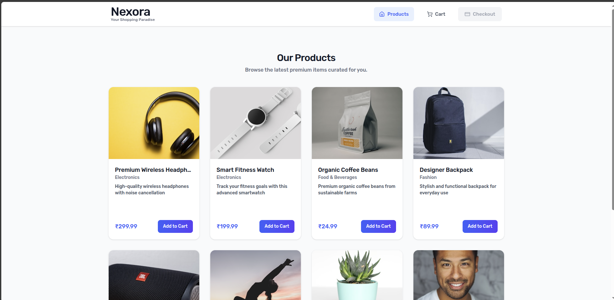
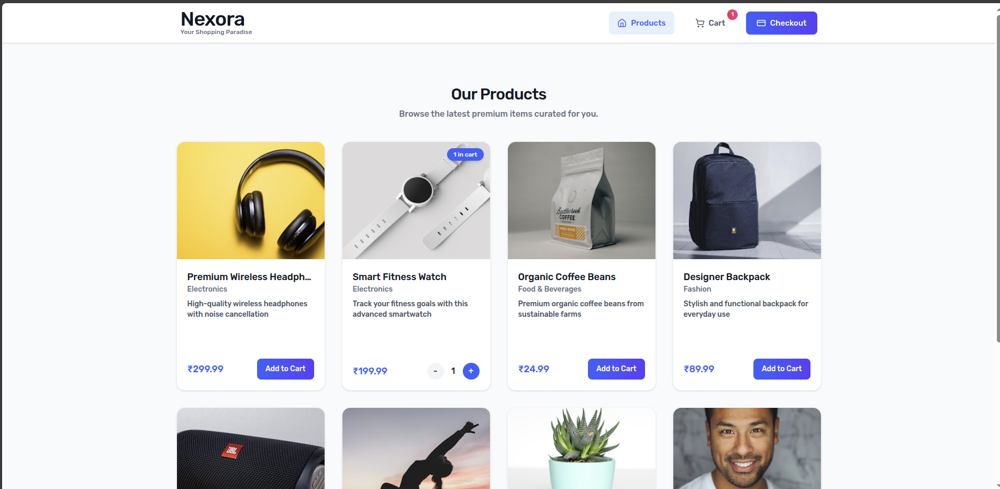
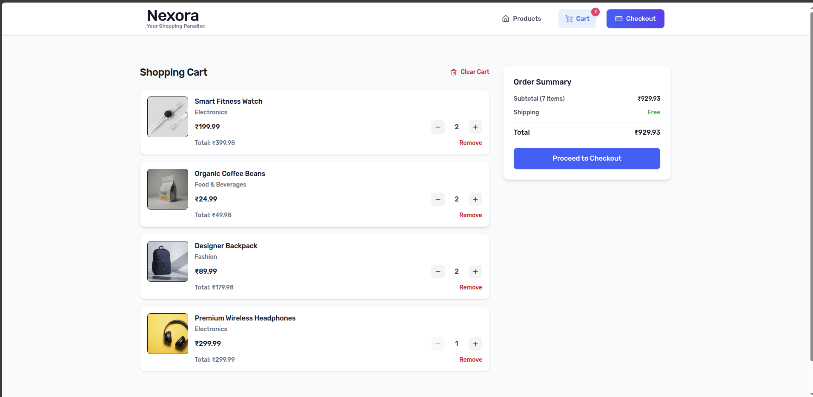
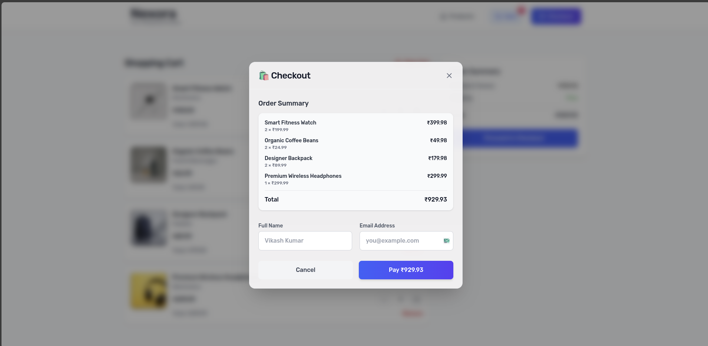
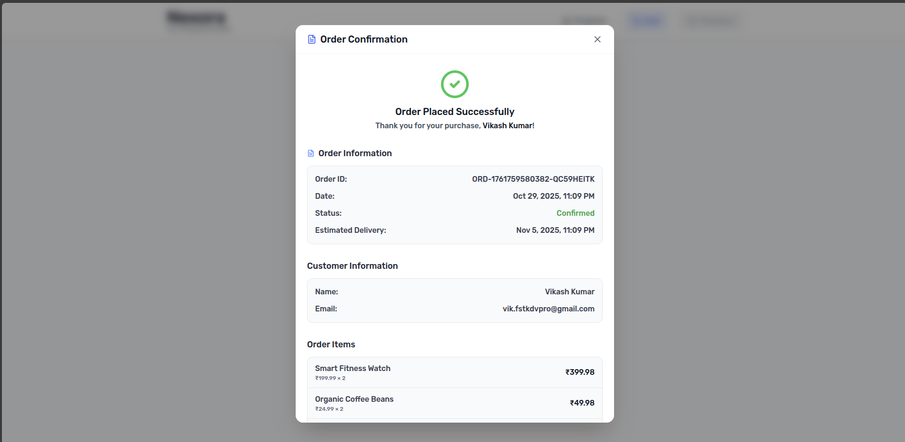
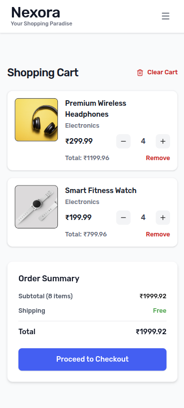
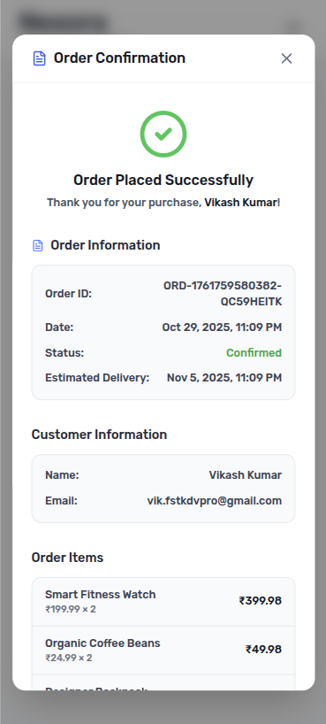

# Full Stack Coding Assignment: Mock E-Com Cart || Nexora    

This repository contains a full-stack coding assignment for building a mock e-commerce cart application using the MERN stack (MongoDB, Express, React, Node). The application allows users to view products, add them to a cart, update quantities, and proceed to checkout.

## Preview & Demo

- _**Screenshots:**_
  
  
  
  
  

  - _**Mobile View Screenshots:**_
    
    
    
    

- _**Demo Video:**_ [View Demo Video](https://www.loom.com/share/8b1f7957b3a34416b63337ab3847e99b/)
- _**Live Preview:**_ [View Live Preview](https://nexora-ecom-cart-demo.vercel.app/)

## Features

- _**Product Listing:**_ Display a list of products fetched from a mock API.
- _**Cart Management:**_ Add, remove, and update product quantities in the cart.
- _**Order Summary:**_ View a summary of the cart with total price calculation.
- _**Responsive Design:**_ Ensure the application is usable on various devices.
- _**State Management:**_ Use React Context API for managing cart state.
- _**Backend API:**_ Simple Express server to handle product data and cart operations.
- _**Error Handling:**_ Graceful handling of errors during API calls and user actions.
- _**Styling:**_ Use Tailwind CSS for styling the frontend components.
- _**Routing:**_ Implement React Router for navigation between pages.
- _**Checkout Process:**_ Simulate a checkout process with form validation.

## Technologies Used

- _**MongoDB:**_ NoSQL database for storing product and user data.
- _**Express JS:**_ Web framework for building the backend API.
- _**React JS:**_ Frontend library for building user interfaces.
- _**Node JS:**_ JavaScript runtime for the backend server.
- _**Tailwind CSS:**_ Utility-first CSS framework for styling.
- _**React Router:**_ Library for handling routing in the frontend.
- _**Axios:**_ Promise-based HTTP client for making API requests.
- _**React Context API:**_ For state management across the application.

## Installation

1. Clone the repository:

   ```bash
      git clone https://github.com/vikashkrdeveloper/nexora-ecom-cart.git
      cd nexora-ecom-cart
   ```

2. Install backend dependencies:

   ```bash
    cd backend
    npm install
   ```

3. Install frontend dependencies:

   ```bash
    cd ../frontend
    npm install
   ```

4. Set up environment variables:

   - Create a `.env` file in the `backend` directory and then copy the contents from `.env.example`.
   - Create a `.env.local` file in the `frontend` directory and then copy the contents from `.env.local.example`.

5. Start the backend server:

   ```bash
    cd ../backend
    npm run dev
   ```

6. Start the frontend development server:

```bash
    cd ../frontend
    npm run dev
```

## Usage

1. Open your web browser and navigate to `http://localhost:5173` to access the frontend application.
2. Browse the product catalog and add items to your cart.
3. View the cart summary and proceed to checkout.
4. Fill in the required information and submit your order.
5. View the order confirmation page.

> Note: Ensure that the backend server is running on `http://localhost:5000` as specified in the frontend environment variables.

## Thank You

Thank you for taking the time to review this assignment. I appreciate your feedback and suggestions for improvement.
